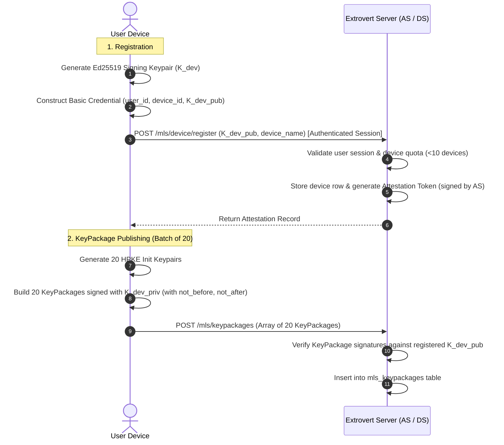
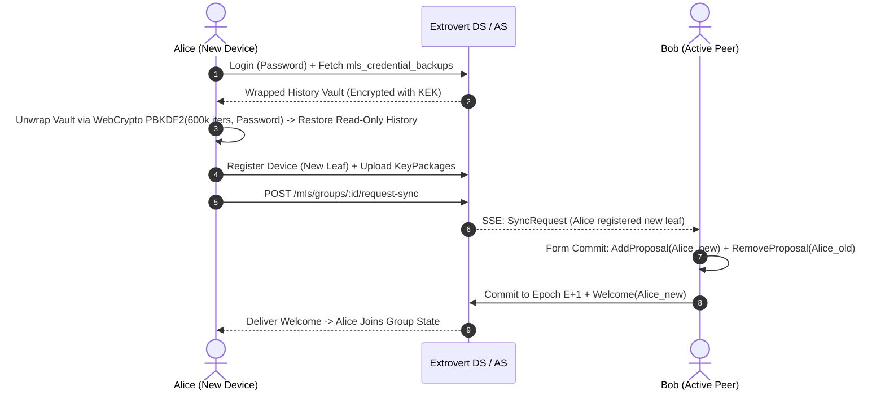

# Extrovert MLS Migration Specification & Phase 0 RFC (RFC 9420)

## 1. Executive Summary & Problem Definition

Extrovert's current end-to-end encryption couples **Olm** (1:1 Double Ratchet) and **Megolm** (group ratchet). While functional for single-device 1:1 chats, multi-device usage and group rooms have resulted in compounding operational failure modes:
1. **$N \times M$ Device Matrix in DMs:** Every new device requires maintaining independent pairwise sessions with every device of every peer, along with baseline snapshots (`sessionInBaseList`), OTK pools, re-key request fallbacks, and multi-device ciphertext fan-out envelopes (`devices: { dev1: ..., dev2: ... }`).
2. **Dead-Slot & Ratchet Desyncs:** When a device is restored or re-registered, older messages or envelope slots sealed to replaced identities cause unrecoverable decryption failures (`[unable to decrypt]`).
3. **Dual Protocol Overhead:** Group rooms run an entirely separate Megolm subsystem with manual 1:1 Olm session key wrapping (`room_group_sessions`, `room_group_session_keys`).

**The Messaging Layer Security (MLS) protocol (RFC 9420)** replaces this patchwork with a single, unified group-ratchet model based on **TreeKEM**:
- **Unified Abstraction:** Both 1:1 DMs and Group Rooms are MLS Groups. A DM is an MLS group with 2 users (and all their active devices as leaf nodes). A Room is an MLS group with $K$ users.
- **Single Ciphertext per Message:** Senders encrypt **once** to the group epoch key. All member devices decrypt the same ciphertext. Ciphertext fan-out envelopes and per-device slot targeting are permanently eliminated.
- **Native Multi-Device Handling:** Adding a device is an `AddProposal` committed to the tree, generating a standard `Welcome` message containing the group secrets.
- **Cryptographic Forward Secrecy & Post-Compromise Security:** Inherent to epoch progression via TreeKEM updates.

---

## 2. Core Cryptographic Architecture & Engine Decision

### 2.1 The WebCrypto Reality & HPKE
Standard WebCrypto (W3C) does **not** implement Hybrid Public Key Encryption (HPKE, RFC 9180), which MLS mandates for encrypting KeyPackages, Welcome messages, and group secrets. Furthermore, native Curve25519 (`X25519`) and `Ed25519` APIs in WebCrypto are only available in recent browser engines and have platform-specific inconsistencies.

### 2.2 Engine Selection: `ts-mls` vs. OpenMLS WASM

| Evaluation Vector | Pure TypeScript (`ts-mls` + `@noble/*`) | OpenMLS compiled to WebAssembly |
| :--- | :--- | :--- |
| **HPKE & RFC 9180** | Pure JS/TS via `@hpke/core` + `@noble/curves` | Native Rust `openmls_rust_crypto` compiled to Wasm |
| **Payload Size** | **242 KB minified / 76.2 KB gzipped** | **~1.4 MB – 2.4 MB `.wasm` binary** + JS bridge |
| **Browser Compatibility** | Universal (runs in any browser, Node, and WebWorkers) | Requires WASM runtime, memory management, and async loading |
| **State Persistence** | Direct JSON/Uint8Array serialization into IndexedDB | Must marshal complex Rust structs across the WASM FFI boundary |
| **Audit Status** | Community-maintained; requires internal audit | Formally audited by Trail of Bits / Cryspen |
| **Build Pipeline** | Zero native dependencies, standard `esbuild` bundle | Requires Rust toolchain, `wasm-pack`, and Docker compilation |

### 2.3 Phase 0 Assurance & Audit Commitment
Because `ts-mls` is community-maintained, we establish the following binding commitments:
1. **RFC 9420 Suite 1 Conformance:** Validated with official test vectors against Suite 1 (`MLS_128_DHKEMX25519_AES128GCM_SHA256_Ed25519`) in `scripts/mls-conformance-test.js`.
2. **Formal Scoped Internal Audit:** Prior to production rollout, an internal audit covering RFC 9420 wire parsing, HPKE framing, TreeKEM parent-hash validation, and transcript hash/confirm MAC checks will be completed and documented in `docs/security/audit-ts-mls.md`.
3. **Rust/Tauri Native Abstraction:** Frontend crypto is encapsulated in `public/mls-client.js`. For desktop/Tauri builds, native Rust `mls-rs` can be swapped via Tauri IPC without altering wire protocols or server state.

---

## 3. Architecture Decision Record (ADR): Identity & Authentication Model

### Decision: Server-Attested Basic Credentials (RFC 9420 Basic Credential)
Extrovert standardizes on standard **RFC 9420 Basic Credentials** containing the device's public Ed25519 key, attested by the Extrovert Server (AS):



### AS Signing Key Lifecycle & Rotation:
- **Storage:** Ed25519 signing key stored in `EXTROVERT_MLS_AS_KEY` environment variable or `/etc/extrovert/as_signing.key` (`0600` permissions).
- **Token Structure:** `{ "kid": "as_2026_v1", "uid": user_id, "did": device_id, "pub": device_pubkey, "exp": expires_at, "sig": ed25519_sig }`.
- **Rotation:** Overlap window of 60 days. Because attestations are verified **strictly at leaf admission** (`AddProposal`), rotating keys has zero impact on active ratchet trees.

---

## 4. Total Device Loss Recovery & Vault Architecture

When Alice loses all devices, recovery is decoupled into **History Vault Restoral** and **Group Re-establishment**:



- **Vault KEK:** Derived client-side via **native WebCrypto PBKDF2-HMAC-SHA-256 with 600,000 iterations** and a 32-byte cryptographically secure salt. Zero WASM binary overhead.
- **Group Re-establishment:** A new leaf cannot impersonate an old, lost leaf secret under RFC 9420 post-compromise security. The peer's client commits an `AddProposal` for the new leaf upon next online sync.

---

## 5. Delivery Service (DS) Specification: Commits & Welcome Replay

### 5.1 The `mls_commits` Table (Catch-Up & Offline Sync)
The DS stores all historical public commits per epoch:
```sql
CREATE TABLE mls_commits (
  id           INTEGER PRIMARY KEY AUTOINCREMENT,
  group_id     TEXT NOT NULL REFERENCES mls_groups(group_id) ON DELETE CASCADE,
  epoch        INTEGER NOT NULL,
  commit_data  TEXT NOT NULL,          -- Base64 encoded MLS Public Message (Commit)
  created_at   INTEGER NOT NULL,
  UNIQUE(group_id, epoch)
);
CREATE INDEX idx_mls_commits_epoch ON mls_commits(group_id, epoch);
```
- **Catch-Up Pipeline:** Devices query `GET /mls/groups/:id/commits?since=E` to catch up from Welcome epoch $E$ to active epoch $E+N$.
- **Retention:** Commits retained for 180 days; epoch 1 and the highest epoch per group are never purged.

### 5.2 Commit Race Handling (409 Conflict & Rebase Loop)
Inside an atomic transaction, the DS enforces CAS epoch validation:
```sql
UPDATE mls_groups SET epoch = ?, updated_at = ? WHERE group_id = ? AND epoch = ?;
```
If rows affected is 0, the DS returns `409 EpochConflict`. The client fetches missed commits, rebases proposals, and retries.

### 5.3 DS Commit Verification & Server-Side Parsing
Before executing the CAS commit transaction, the DS parses the `PublicMessage(Commit)` framing to verify:
1. The sender leaf corresponds to the authenticated caller's device in `mls_group_members`.
2. Proposals are authorized for the sender's role.
3. The expected prior epoch matches `mls_groups.epoch`.
4. Parent hash and tree hash chain validations pass.

---

## 6. KeyPackage Pool Lifecycle (Two-Phase Claiming)

KeyPackages are strictly **single-use** with active lifetime enforcement:

```sql
CREATE TABLE mls_keypackages (
  id              INTEGER PRIMARY KEY AUTOINCREMENT,
  user_id         INTEGER NOT NULL REFERENCES users(id) ON DELETE CASCADE,
  device_id       TEXT NOT NULL,
  keypackage_ref  TEXT,
  keypackage_data TEXT NOT NULL,
  ciphersuite     INTEGER NOT NULL DEFAULT 1,
  not_before      INTEGER NOT NULL,
  not_after       INTEGER NOT NULL,
  created_at      INTEGER NOT NULL,
  consumed_at     INTEGER DEFAULT NULL
);
CREATE INDEX idx_mls_kp_available ON mls_keypackages(user_id, not_before, not_after, consumed_at);
CREATE UNIQUE INDEX idx_mls_kp_unique ON mls_keypackages(device_id, keypackage_ref);
```

### Two-Phase Claim Protocol & RFC 9420 RefHash:
1. **KeyPackageRef Requirement:** Every uploaded KeyPackage must include a valid 64-character hex `keypackage_ref` computed via RFC 9420 `RefHash("MLS 1.0 KeyPackage Reference", KeyPackage)`. Re-publishing identical packages is idempotently deduplicated via `idx_mls_kp_unique`.
2. **Fetch Available:** `GET /mls/keypackages/:userId` returns candidate KeyPackages with database IDs, **without consuming them**.
3. **Atomic Consume:** `POST /mls/keypackages/consume` accepts `{ "keypackage_ids": [101, 104] }`. Only packages incorporated into an issued commit are consumed.
4. **Replenishment:** Client maintains a pool of 20 packages and uploads 15 when status reports `< 5` remaining.

---

## 7. Group Lifecycle & Moderation (Zero Server Leaf)

### Client-Moderated Kicks & Removals (RFC 9420 Conformance)
Extrovert **does not use a server-side DS leaf**. The server never participates in the ratchet tree and holds zero group secrets:
1. **Admin / Moderator Kick:** When a moderator kicks a user, the moderator's client submits a `RemoveProposal(target_leaf)` commit to advance the epoch from $E$ to $E+1$. The kicked member is evicted from the tree; any subsequent messages at epoch $E+1$ cannot be decrypted by the kicked user.
2. **Voluntary Leave (RFC 9420 Section 7.4):** RFC 9420 mandates that a committer *cannot* commit a Remove proposal removing themselves. Therefore, for voluntary leave:
   - The departing client publishes a standalone `RemoveProposal(self)` to `POST /mls/groups/:id/proposals`.
   - The remaining active peer (or room committer) incorporates this proposal into their next commit to advance the epoch and blank the departed leaf.
   - The departing client immediately wipes their local group state and purges group keys from IndexedDB (`STORE_MLS_GROUPS`).
3. **Deactivated Accounts:** The server flags the user as deactivated in the database; active group members' clients automatically fold a `RemoveProposal` into their next commit upon sync.

### 7.1 Room MLS Capability Cache & Invalidation
- **Cache Key:** Keyed per room and participant set: `room:<roomId>:<sorted_other_user_ids>`.
- **Invalidation Triggers:**
  1. *Roster Changes:* Adding, kicking, or leaving members immediately changes the participant set, bypassing stale cache.
  2. *Explicit Busting:* `ExtrovertMLS.invalidateRoomMlsSupport(roomId)` purges all matching cache entries upon member add/kick/leave events.
  3. *TTL Expiry:* 60-second background TTL ensures eventual consistency when an existing member registers their first MLS device out-of-band.

### 7.2 Dual-Stack Transition Window & Key Retention
- **Megolm State Retention:** Active `InboundGroupSession`s (`groupInbound` / `STORE_OLM`) and Olm 1:1 sessions are permanently retained in IndexedDB.
- **Zero Key Purge on Upgrade:** Upgrading a room or DM conversation to MLS does *not* delete or purge legacy Megolm session keys.
- **Protocol Dispatch:** Messages tagged with `proto: 'mls'` route to the MLS ratchet engine; legacy or untagged messages route to Megolm/Olm.
- **In-Flight Resiliency:** Any delayed, interleaved, or replayed Megolm messages arriving during or after the upgrade window are transparently decrypted without message loss. Megolm keys are retained until the offline Phase 4 pre-decryption vault migration pass is verified.

### 7.3 Legacy Key Drop & Retention Timing Policy
- **Coexistence Ratchet Semantics:** Legacy Olm/Megolm sessions remain operational for incoming messages during the coexistence window (they must advance ratchets to decrypt new ciphertext from peers who haven't yet migrated). No new Olm/Megolm sessions are initiated — all outgoing messages prefer MLS when the peer supports it.
- **Clock Origin & Dynamic Activity Anchor:**
  - The 180-day retention clock is anchored to the *later* of the device's first successful MLS session or its last legacy activity:
    $$\text{ClockOrigin} = \max(t_{\text{firstMLS}}, t_{\text{lastLegacyActivity}})$$
  - $t_{\text{lastLegacyActivity}}$ is updated on every inbound or outbound `proto: 'olm'` or `proto: 'megolm'` encrypt/decrypt event (batched daily to minimize storage writes).
  - This prevents premature session purges when legacy peers remain active in shared rooms or 1:1 threads.
- **Unmigrated Safety Gate:**
  - The day-180 purge is strictly conditional on the migration worker having completed at least one full pass (checkpoint `hasCompletedFullScan === true`).
  - Devices that have never completed a migration pass retain legacy sessions indefinitely, with a user-visible `"Legacy sessions retained (unmigrated)"` status in Settings > Security.
  - Pre-decryption dependency rule: `@matrix-org/olm`, `olm.js`, and `olm.wasm` MUST remain available on the client device until its local vault migration is verified complete. There is no global "remove Olm" moment; decommissioning is strictly local and per-device.
- **Client Lifecycle State Machine:**
```
  [LegacyActive]
        │
        │ (First successful MLS session registered)
        ▼
  [CoexistenceAndMigrating]
        │
        │ (Migration worker reaches server tip:
        │  res.has_more === false -> hasCompletedFullScan = true)
        ▼
  [RetentionWindow] ◄────────────────────────────────────────┐
        │                                                    │
        │                                                    │ Inbound/outbound legacy traffic
        │ Gate 1: now - max(t_firstMLS, t_lastLegacy) >= 180d│ resets t_lastLegacyActivity;
        │  AND                                               │ extends clock, stays in RetentionWindow
        │ Gate 2: hasCompletedFullScan === true              │ (or reverts PurgeEligible -> RetentionWindow)
        ▼                                                    │
  [PurgeEligible] ───────────────────────────────────────────┘
        │
        │ (Automated background cleanup or user clicks "Purge Legacy Sessions Now")
        ▼
  [OlmPurged (MLS-Only Vault)]
```
- **Terminal State Behavior (`OlmPurged`):**
  - In `OlmPurged`, inbound messages with `proto: 'olm'` or `proto: 'megolm'` are undecryptable.
  - The client displays `[Legacy message — encryption retired]` and records a telemetry event. No attempt is made to reload `olm.js` or reconstruct legacy sessions.
- **User-Visible Signal:**
  - Status banner in Settings > Security > Encryption:
    `"Legacy Encryption (Olm/Megolm): Archived. Complete session retirement scheduled in X days."`
  - Manual action button: `"Purge Legacy Sessions Now"`, allowing privacy-conscious users to immediately wipe Olm key material once their local pre-decryption migration pass completes and `hasCompletedFullScan === true`.

### 7.4 Pre-Decryption Migration Worker & Fault Tolerance
- **Trigger & Pacing:**
  - Automatic background worker executed on idle (`requestIdleCallback` with 5s fallback timer) after MLS initialization.
  - Processed in batches of 50 messages to avoid main thread stutter and IndexedDB lock contention.
- **Monotonic Global Ordering:**
  - Messages are processed in global message-ID order. Because IDs are globally monotonic and per-session messages preserve their relative ordering, Olm/Megolm ratchets advance correctly without per-session coordination.
- **Checkpoint Recovery:**
  - Progress tracked in IndexedDB (`STORE_MLS_KEYS`, key `'migration:checkpoint'`) storing `{ dmCursor, roomCursor, totalMigrated, failedCount, hasCompletedFullScan, updatedAt }`.
  - Resilient to unexpected browser termination: worker resumes from cursors without reprocessing or duplicate encryption.
- **Failure Classification & Cascade Taxonomy:**
  - `SESSION_EXPIRED`: Session not found in `STORE_OLM`. Cascades across all messages in that session: labeled `"session expired prior to vault migration"`.
  - `RATCHET_DESYNC`: Session present, but chain key advanced past message index or Olm skipped-key limit (>2000) exceeded. Cascades for messages prior to current ratchet position only: labeled `"ratchet advanced past this message"`.
  - `CORRUPT_PAYLOAD`: Single message ciphertext damaged or unparseable. **Does not cascade**: because Double Ratchet / Megolm ratchet state is not advanced on decryption errors, subsequent valid messages in the same session remain decryptable. Only the damaged message is labeled `"message ciphertext corrupted"`.
  - Failed messages are flagged with `unrecoverable: true` and their diagnostic label in the local plaintext vault (`STORE_SECURE_MESSAGES`), ensuring the migration loop never hangs or blocks the batch.
  - *Empirical Note:* Real-world failure rate is a function of $\frac{\text{messages-in-degraded-sessions}}{\text{total-messages}}$, not $\frac{\text{sessions-failed}}{\text{total-sessions}}$. Synthetic benchmark indicates 1–3% is achievable if real-world distributions match assumptions; production validation pending.

### 7.5 Data Export Semantics (GDPR Article 20 / Portable Archive)
- **Encryption by Default:**
  - Encrypted export (password-protected via PBKDF2/Argon2 + AES-256-GCM) is the default for all data archives.
  - Plaintext export is available as an explicit opt-in behind a user warning confirmation dialog, recording explicit user acknowledgment in the export metadata.
- **Export Inclusions & Payload Optimization:**
  - Exports include the **consolidated decrypted plaintext vault** (covering all pre-decrypted historical Olm/Megolm messages and MLS application messages) formatted as standardized JSON.
  - Ephemeral Olm ratchets, raw pairwise ciphertext envelopes, and unpicked session blobs are explicitly excluded, reducing payload size by excluding session state.
- **Unrecoverable Message Handling:**
  - Messages flagged as unrecoverable export with a structured diagnostic placeholder:
    `"[Message unrecoverable: legacy session expired prior to vault migration]"`.
  - Preserves full auditability, timeline chronology, and regulatory compliance.

### 7.6 Server-Side Sunset Sequence & Privacy-Preserving Telemetry
- **Independence of the Two Clocks:**
  - The per-device 180-day retention clock and the server-global 365-day cutoff are independent. A device is purge-eligible based on its own `ClockOrigin`; the server rejects new legacy traffic based on `MLS_MIGRATION_START_DATE`.
  - *Worst-case device schedule:* 365 days (server cutoff stops clock resets) + 180 days (retention window) = **545 days** before final local purge.
- **Server-Side Hard Cutoff Date (Phase 6):**
  - Exactly 365 days post-migration launch (`MLS_MIGRATION_START_DATE` env var, falling back to database `mls_devices` creation timestamp):
    1. Incoming `proto: 'olm'` and `proto: 'megolm'` submissions are rejected with `410 Gone` (`{ error: "Protocol deprecated: MLS upgrade required" }`).
    2. Legacy session claim and prekey endpoints are retired.
- **Indefinite Legacy Row Retention:**
  - Historical rows in `messages` and `room_messages` with `proto IN ('olm', 'megolm', 'rsa')` are **never deleted from the database**.
  - Late or returning offline devices can still invoke `GET /mls/migration/messages` to pre-decrypt their history into their local vault using their retained device keys. Storage growth is strictly zero after Day 365.
- **Config Transport (`legacyE2eeEnabled`):**
  - Web clients receive the flag via SSR injection in `src/views/partials/header.ejs`: `<script>window.ExtrovertConfig = window.ExtrovertConfig || {}; window.ExtrovertConfig.legacyE2eeEnabled = <%= serverLegacyEnabled %>;</script>`.
  - Native/programmatic clients query `GET /mls/config` on startup.
- **Operator Safety & Audit for `MLS_FORCE_SUNSET`:**
  - Forcing legacy deactivation when criteria are not met requires both `MLS_FORCE_SUNSET=true` AND `MLS_FORCE_SUNSET_ACK="I_ACCEPT_DATA_LOSS"`.
  - Server logs at `CRITICAL`, records an audit event in `mls_sunset_audit` table, and exposes `"force_sunset_active": true` in `GET /mls/migration/fleet-summary`.
- **Multi-Criteria Fleet Telemetry (`GET /mls/migration/fleet-summary`):**
  - Returns explicit sub-criteria to eliminate operator footguns:
    ```json
    {
      "traffic_sunset": {
        "consecutive_zero_legacy_days": 32,
        "required_days": 30,
        "ready": true
      },
      "fleet_migration": {
        "total_users": 100,
        "migrated_users": 50,
        "fleet_coverage_pct": 50,
        "required_coverage_pct": 100,
        "ready": false
      },
      "time_window": {
        "migration_start_date": "2026-10-05T00:00:00.000Z",
        "sunset_cutoff_date": "2027-10-05T00:00:00.000Z",
        "days_elapsed": 200,
        "days_required": 180,
        "ready": true
      },
      "all_criteria_met": false,
      "force_sunset_active": false
    }
    ```
  - `all_criteria_met` requires `traffic_sunset.ready && fleet_migration.ready && time_window.ready`.
- **Privacy-Preserving Telemetry (`POST /mls/migration/status`):**
  - Clients report coarse buckets (`"0"`, `"1-10"`, `"11-100"`, `"100+"`) and aggregated totals. Device IDs are omitted; reports are stored per-user.

---

## 8. Database Schema (`src/db.js`)

```sql
-- Normalized Group Membership
CREATE TABLE IF NOT EXISTS mls_group_members (
  group_id     TEXT NOT NULL REFERENCES mls_groups(group_id) ON DELETE CASCADE,
  user_id      INTEGER NOT NULL REFERENCES users(id) ON DELETE CASCADE,
  device_id    TEXT NOT NULL,
  leaf_index   INTEGER NOT NULL,       -- Ephemeral observation; not used for identity
  role         TEXT NOT NULL DEFAULT 'member', -- 'creator', 'admin', 'member'
  joined_at    INTEGER NOT NULL,
  removed_at   INTEGER DEFAULT NULL,
  PRIMARY KEY (group_id, user_id, device_id)
);
CREATE INDEX IF NOT EXISTS idx_group_members_active ON mls_group_members(group_id, removed_at);
CREATE INDEX IF NOT EXISTS idx_user_active_groups ON mls_group_members(user_id, removed_at);

-- Standalone Public Proposals
CREATE TABLE IF NOT EXISTS mls_proposals (
  group_id      TEXT NOT NULL REFERENCES mls_groups(group_id) ON DELETE CASCADE,
  epoch         INTEGER NOT NULL,
  proposal_ref  TEXT NOT NULL,          -- SHA-256 hash of wire bytes
  sender_leaf   INTEGER NOT NULL,
  proposal_type INTEGER NOT NULL,
  proposal_data TEXT NOT NULL,          -- Base64 encoded Proposal
  created_at    INTEGER NOT NULL,
  consumed_at   INTEGER DEFAULT NULL,
  PRIMARY KEY (group_id, proposal_ref)
);
CREATE INDEX IF NOT EXISTS idx_proposals_pending ON mls_proposals(group_id, epoch, consumed_at);

-- Welcome Delivery with Two-Phase ACK State Machine
CREATE TABLE IF NOT EXISTS mls_welcomes (
  id           INTEGER PRIMARY KEY AUTOINCREMENT,
  group_id     TEXT NOT NULL REFERENCES mls_groups(group_id) ON DELETE CASCADE,
  user_id      INTEGER NOT NULL REFERENCES users(id) ON DELETE CASCADE,
  device_id    TEXT NOT NULL,
  welcome_data TEXT NOT NULL,
  created_at   INTEGER NOT NULL,
  fetched_at   INTEGER DEFAULT NULL,
  acked_at     INTEGER DEFAULT NULL
);
CREATE INDEX IF NOT EXISTS idx_welcomes_pending ON mls_welcomes(user_id, device_id, acked_at);

-- Group-Scoped Idempotency
CREATE TABLE IF NOT EXISTS mls_idempotency (
  group_id        TEXT NOT NULL REFERENCES mls_groups(group_id) ON DELETE CASCADE,
  idempotency_key TEXT NOT NULL,
  epoch           INTEGER NOT NULL,
  commit_hash     TEXT NOT NULL,
  created_at      INTEGER NOT NULL,
  expires_at      INTEGER NOT NULL,
  PRIMARY KEY (group_id, idempotency_key)
);
CREATE INDEX IF NOT EXISTS idx_mls_idempotency_exp ON mls_idempotency(expires_at);

-- Encrypted Credential & History Backups
CREATE TABLE IF NOT EXISTS mls_credential_backups (
  user_id     INTEGER PRIMARY KEY REFERENCES users(id) ON DELETE CASCADE,
  backup_data TEXT NOT NULL,
  salt        TEXT NOT NULL,
  nonce       TEXT NOT NULL,
  updated_at  INTEGER NOT NULL
);
```

---

## 9. Historical Message Migration & Phased Decommissioning
1. **Pre-Decryption Pass (Phase 4):** Active clients execute an on-device migration pass iterating through existing Olm/Megolm messages monotonically, decrypting them via active sessions, and storing plaintext in IndexedDB `STORE_SECURE_MESSAGES` (encrypted under local `deviceKey`).
2. **Force-Upgrade on MLS Activation:** Conversations switch immediately to MLS once participants possess MLS-capable devices. Legacy devices display a refresh/update prompt and cannot send messages until upgraded.
3. **Phase 5 (Decommissioning Preparation & Coexistence):**
   - Feature flag `E2EE_LEGACY_ENABLED` (default: `true`) acts as a non-destructive client-side kill switch.
   - Client and server telemetry instrument fleet migration coverage and 30-day zero legacy traffic.
   - `@matrix-org/olm`, `olm.js`, and `olm.wasm` are retained throughout the 180-day coexistence window to ensure unmigrated and offline devices never lose message history.
4. **Phase 6 (Server Sunset & File Removal):**
   - After Day 365 or after all three sunset criteria are met (100% active device migration coverage, 30 consecutive days of zero legacy traffic, 180+ days elapsed):
     - Server enforces `410 Gone` on legacy message submission endpoints.
     - `@matrix-org/olm`, `public/lib/olm.js`, and `public/lib/olm.wasm` are permanently removed.
     - Legacy database tables and handlers are dropped.
